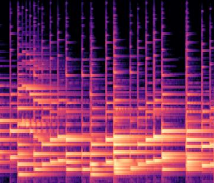

# Learning Machine Learning
Tensorflow and ML stuff

## Projects

### 1. Music Emotions Classifier

Summary: Organizes your music library depending on the emotion that the song evokes
Can give a breakdown of the emotions (by %) present in a given song (either by mp3 file or youtube link)

Categories : Happy, Sad, Motivational, Relaxing, Angry, Tense

Use Case:  If a person is feeling excited about something, they can simply navigate to the "Motivational" directory in their organized song library and listen to the songs there. People enjoy listening to music that matches their current emotions.

How it was done:
* The mp3 file was decoded and split up into segments of 10 seconds each
* Each audio segment was converted to a spectrogram using the Librosa library.
* Below is a spectrogram of sad song segment
* 

* I also augmented the data by slightly stretching/distorting the images and adding random noise

* I then fine tuned the last layer of InceptionV3 for the augmented data, reaching a final test accuracy of ~80%.

* The library organizer classifies each 10 second segment of the song to an emotion and then picks the highest occuring emotion in the song, and classifies the entire song as that emotion.

### 2. Classify Instruments using a ConvNet
* This project was done just to learn how to implement convolutional nets in TensorFlow
* I got some pictures from google of various guitars, pianos, violins, and random objects (which would be classified as neither) and then augmented the data with stretches, noise, rotations, and crops.
* Trained and tested a CNN to recognize these different instruments, reaching a final accuracy of ~90%
* Ported this model to android where the user takes a picture and the image is preprocessed (zero centered) and then fed through the model.
